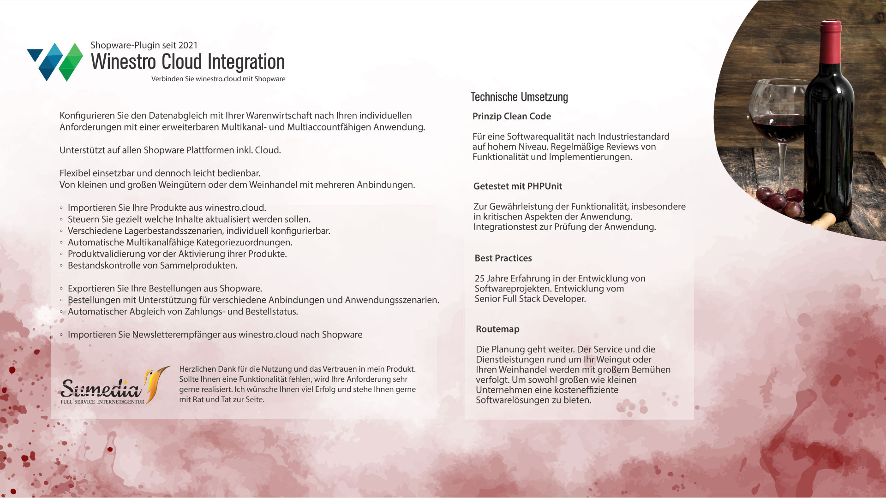

# Winestro Cloud Integration für Shopware 6

Winestro Cloud Integration ist eine inoffizielle Open Source Lösung zu Winestro Cloud Integration in Shopware 6.
Die Anwendung wird über den Support finanziert.

6 Monate Support für 150 € zzgl. MwSt.

Alle Arbeiten am Plugin werden mit dieser kleinen Gegenleistung refinanziert.
Ansonsten können Sie das Plugin kostenfrei gewerblich nutzen.
Ziel ist es, dass mein Eingreifen gar nicht notwendig sein soll.
Es ist eine gut getestete aber recht junge Applikation.

[Sumedia Software auf meiner Webseite](https://www.sumedia-webdesign.de/software.html)

Die offizielle Applikation finden Sie unter:

[Winestro Cloud im Shopware Store](https://store.shopware.com/de/cnnct90022917533m12/winestro.cloud.html)

Die inoffizielle Winestro Cloud Integration ist ein historisch entstandenes Programm, das so lange gepflegt wird, wie Bedarf daran besteht.

Die Applikation wurde abschließend getestet.
Für kritische Vorgänge wurden spezielle Unit-Tests ausgeführt.
Steht ab jetzt zur Verfügung.

Bei weiteren Fragen stehe ich Ihnen gerne zur Verfügung: [kontakt@sumedia-webdesign.de](mailto:kontakt@sumedia-webdesign.de) 

## API URL

https://weinstore.net/xml/v21.0

## Dokumentation

[Winestro Cloud Integration](https://sumedia-webdesign.atlassian.net/wiki/spaces/WINESTRO/pages/1081396/Winestro+Cloud+Integration)

 

